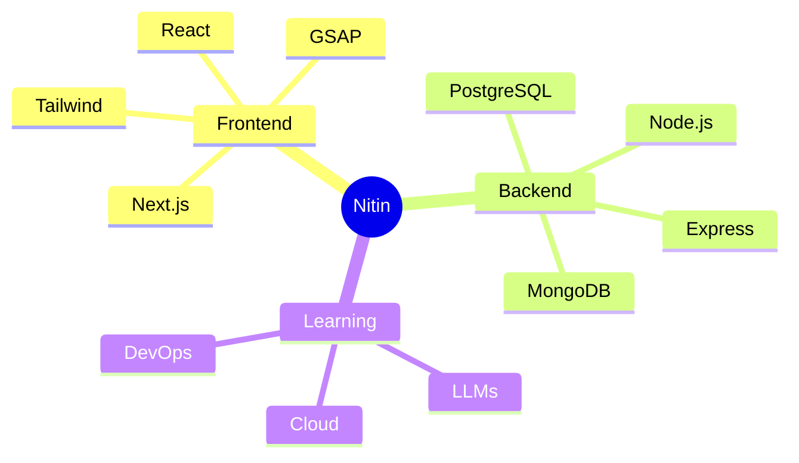

<div align="center">


<p>
  <a href="https://github.com/NitinPatwa"></a>
  <a href="https://www.linkedin.com/in/YOUR-LINKEDIN-USERNAME"></a>
  <a href="mailto:nitiniiitr@gmail.com"></a>
</p>

<p>
I'm passionate about building <b>real-world solutions</b> with modern web technologies.<br/>
Specializing in <b>interactive UIs</b>, <b>smooth animations</b>, and <b>scalable architectures</b>.<br/>
<i>Always curious. Always building. Always improving.</i>
</p>

</div>

<br/>

<div align="center">

</div>

<br/>

<div align="center">

<table>
<tr>
<td width="50%" valign="top">

<h3 align="center">👨‍💻 About Me</h3>

```javascript
const nitin = {
    location: "Ranchi, Jharkhand 🇮🇳",
    role: "Full Stack Developer",
    code: ["JavaScript", "C++", "Python"],
    focus: ["Next.js", "GSAP", "LLMs"],
    currentlyLearning: "Cloud & DevOps",
    lookingFor: "Full-time opportunities",
    funFact: "I animate everything! ✨"
};
```

<p align="left">
• 🚀 Building <b>interactive web experiences</b><br/>
• ⚡ Specializing in <b>GSAP animations</b><br/>
• 🤖 Exploring <b>LLM integrations in JS</b><br/>
• 🎯 Open to <b>collaborations</b><br/>
• 📧 <b>nitiniiitr@gmail.com</b>
</p>

</td>
<td width="50%" valign="top">

<h3 align="center">🎯 Current Focus</h3>



</td>
</tr>
</table>

</div>

<br/>

<div align="center">

</div>

<br/>

<div align="center">

<h2>🛠️ Tech Arsenal</h2>

<h3>Languages</h3>

<p>


</p>

<h3>Frontend Frameworks & Libraries</h3>

<p>


</p>

<h3>Backend & Databases</h3>

<p>


</p>

<h3>Tools & Technologies</h3>

<p>


</p>

</div>

<br/>

<div align="center">

</div>

<br/>

<div align="center">

<h2>✨ What I Build</h2>

<table>
<tr>
<td align="center" width="33%">
<br/>
<b>Animated Web Apps</b><br/>
<sub>GSAP • Smooth Interactions</sub>
</td>
<td align="center" width="33%">
<br/>
<b>Full Stack Solutions</b><br/>
<sub>MERN • Next.js • PostgreSQL</sub>
</td>
<td align="center" width="33%">
<br/>
<b>LLM Integrations</b><br/>
<sub>AI-Powered Features</sub>
</td>
</tr>
<tr>
<td align="center" width="33%">
<br/>
<b>Utility Tools</b><br/>
<sub>Automation • Productivity</sub>
</td>
<td align="center" width="33%">
<br/>
<b>Responsive Design</b><br/>
<sub>Tailwind • Modern UI</sub>
</td>
<td align="center" width="33%">
<br/>
<b>Docker Containers</b><br/>
<sub>Scalable Deployments</sub>
</td>
</tr>
</table>

</div>

<br/>

<div align="center">

</div>

<br/>

<div align="center">

<h2>🌟 Philosophy</h2>

```
┌─────────────────────────────────────────────────────────────┐
│                                                             │
│  "Every project starts with a blank file —                 │
│   and unlimited possibilities."                            │
│                                                             │
│  I believe in:                                              │
│  • Building products that matter 🎯                         │
│  • Clean, maintainable code 🧹                              │
│  • Continuous learning 📚                                   │
│  • Smooth user experiences ✨                               │
│                                                             │
└─────────────────────────────────────────────────────────────┘
```

</div>

<br/>

<div align="center">

</div>

<br/>

<div align="center">

<h2>🤝 Let's Connect</h2>

<a href="https://github.com/NitinPatwa">
  
</a>
&nbsp;&nbsp;
<a href="https://www.linkedin.com/in/YOUR-LINKEDIN-USERNAME">
  
</a>
&nbsp;&nbsp;
<a href="mailto:nitiniiitr@gmail.com">
  
</a>

<br/><br/>

<p>
💼 <b>Open to full-time opportunities</b><br/>
🤝 <b>Available for interesting collaborations</b><br/>
☕ <b>Let's build something amazing together!</b>
</p>

</div>

<br/>

<div align="center">

</div>
